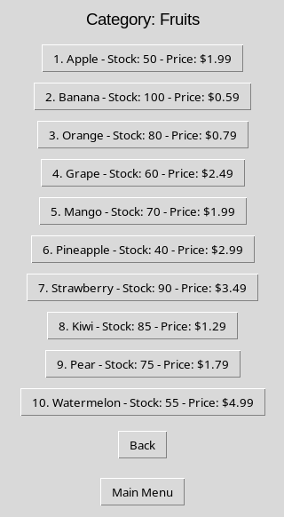
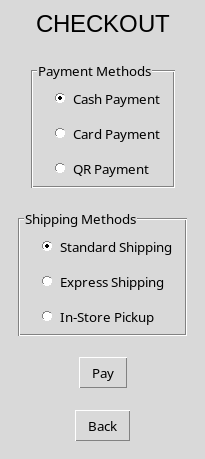

# Paradigmas 1er Final

## Estructura del Proyecto

```sh
    Delvalle_Ian_codigoFuente
    │
    ├── components
    │   ├── frames.py
    │   ├── addPage.py
    │   ├── cartPage.py
    │   ├── checkPage.py
    │   ├── loginPage.py
    │   ├── profilePage.py
    │   └── registerPage.py
    │
    ├── schemas
    │   ├── client_manager.py
    │   ├── file_manager.py
    │   ├── polymorphism.py
    │   └── product_manager.py
    │
    ├── db
    │   └── inventory.txt
    │
    ├── main.py
    └── README.md
```

## Pasos para Ejecutar el Proyecto

1. Asegúrate de tener `Python3` o superior y el modulo `python3-tk` instalado en tu sistema:

```sh
python --version
apt show python3-tk
git --version
```

2. Descarga el proyecto desde GitHub:

```sh
git clone https://github.com/ianmrc23/paradigmas_1erFinal.git
```

3. Navega hasta la ubicación donde has descargado el proyecto (eliminar la carpeta .git es opcional):

```sh
cd paradigmas_1erFinal
rm -rf .git
```

4. Ejecuta el archivo `main.py`:

```sh
python main.py
```

# Uso del Programa

## Primera Ejecución

Si es la primera vez que ejecutas el programa verás algo así en la terminal:

```sh
[+] Inventory data has been saved as inventory.pickle
```

Esto ocurre ya que no se encontró el archivo `inventory.pickle` que sirve para la persistencia
de datos de los productos, por lo tanto se crea uno nuevo, las siguientes ejecuciones ya no harán
este paso.

## Guía rápida de las funciones mas importantes

### Auth window

La primera ventana que veremos es la del registro de usuario


Si no has creado ningún usuario, utiliza `register` para crear tu usuario:


Si ya tienes usuario, utiliza `login` para iniciar sesión:


### Home window

Luego aparecerá el menú principal:


### Add Product window

Vamos a agregar un producto a nuestro carrito, utilizando `Add Product`, a continuación
seleccionamos la `categoría` que nos guste, el `producto` que buscamos e ingresaremos por teclado
la `cantidad` que vamos a llevar:





### My cart window

Podremos ver todo lo relacionado con nuestros productos en `My Cart`, como las `lista` de todos los
productos que hemos añadido, `eliminar` un producto especifico o `limpiar` el carrito eliminando
todos los productos a la vez:


### Profile window

`Profile` es la opción que te conviene si quieres ver tus datos, por ahora no se pueden modificar:


### Check Out window

Por último, veremos el `checkout`, donde tendremos que elegir nuestro método de pago y envió para
poder finalizar la compra:




Con esto hemos explorado la mayoría de las funciones disponibles. Espero que les haya gustado!
Gracias por llegar hasta aquí.
